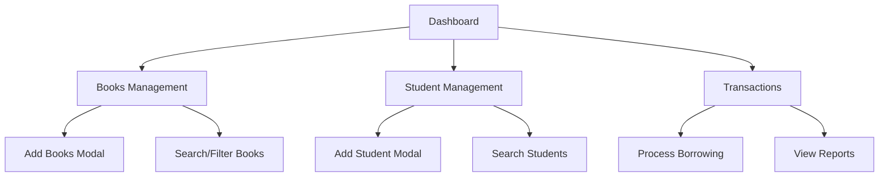

## 1. Product Overview
BCULMS (Bicol University College Learning Management System) is a desktop-based library management application built with Neutralino.js. This project focuses on optimizing the front-end UI/UX design by enhancing HTML semantic markup, improving CSS styling with modern responsive design principles, and properly implementing Bootstrap 5 components using only local dependencies.

The optimization aims to improve user experience, accessibility, and visual consistency while maintaining all existing functionality and the project's institutional branding (Bicol University's red and gold color scheme).

## 2. Core Features

### 2.1 User Roles
| Role | Registration Method | Core Permissions |
|------|---------------------|------------------|
| Library Staff | System administrator setup | Full access to all library management functions |
| Student Assistants | Staff-assigned accounts | Limited access to borrowing/returning functions |

### 2.2 Feature Module
The BCULMS application consists of the following main pages:
1. **Dashboard**: Statistics overview, notifications, recent activities, and quick actions
2. **Books Management**: Book catalog, search, filtering, and bulk add functionality
3. **Book Copies Management**: Individual copy tracking and status management
4. **Student Management**: Student records, search, filtering, and status tracking
5. **Borrow Transactions**: Book borrowing records and management
6. **Library Transactions**: Overall library transaction history and reporting

### 2.3 Page Details
| Page Name | Module Name | Feature description |
|-----------|-------------|---------------------|
| Dashboard | Statistics Cards | Display total books, borrowed books, overdue books, and active students with real-time data updates |
| Dashboard | Notifications Panel | Show overdue book alerts and system notifications with color-coded priority levels |
| Dashboard | Recent Activities | Display recent borrowing/returning transactions with timestamps |
| Dashboard | Quick Actions | Provide shortcuts to add books, archive books, add student records, and access transactions |
| Books Management | Search & Filter | Implement responsive search bar with department-based filtering and pagination |
| Books Management | Book Table | Display book details in sortable, responsive table with hover effects |
| Books Management | Add Book Modal | Support single and bulk book addition with form validation and date format options |
| Student Management | Student Search | Search students by ID, name, or department with real-time filtering |
| Student Management | Student Table | Show student details, borrowing status, and overdue information |
| Student Management | Add Student Modal | Form for adding new students with validation and course selection |
| Transactions | Borrow Records | Display borrowing history with status tracking and overdue indicators |
| Transactions | Library Overview | Show comprehensive transaction statistics and reports |

## 3. Core Process
**Library Staff Workflow:**
1. Login to dashboard → View system statistics and notifications
2. Navigate to Books section → Search/catalog books → Add new books (single/bulk)
3. Access Student section → Manage student records → Track borrowing status
4. Use Transactions section → Process borrow/return operations → Generate reports

**Student Assistant Workflow:**
1. Access limited dashboard → View basic statistics
2. Use Borrow Transactions → Process book borrowing/returning
3. Search student records → Verify borrowing eligibility

## 4. User Interface Design

### 4.1 Design Style
- **Primary Colors**: #7d0000 (Bicol University Red), #eede36 (Gold accent)
- **Secondary Colors**: #550000 (Dark red for sub-menus), Bootstrap 5 default colors
- **Typography**: Outfit variable font (100-900 weight range) for all text elements
- **Layout Style**: Fixed sidebar navigation with main content area, card-based components
- **Button Style**: Bootstrap 5 rounded buttons with consistent sizing and hover effects
- **Icon Style**: Bootstrap Icons with consistent sizing and color coordination
- **Animation**: Smooth transitions (0.3s ease) for hover states and sidebar interactions

### 4.2 Page Design Overview
| Page Name | Module Name | UI Elements |
|-----------|-------------|-------------|
| Dashboard | Statistics Cards | Bootstrap card components with shadow effects, gradient background overlay on building image, responsive grid layout |
| Dashboard | Navigation Sidebar | Fixed position sidebar (200px width), collapsible sub-menus, active state indicators with left border accent |
| Dashboard | Quick Actions | Bootstrap button groups with consistent spacing, primary/info color scheme, responsive button sizing |
| Books/Students | Data Tables | Striped and hoverable Bootstrap tables, pagination controls, search bars with icon integration |
| All Pages | Modals | Centered modal dialogs with proper header/footer structure, form validation styling, backdrop effects |
| All Pages | Background | Full-screen building image with gradient overlay, proper z-index layering, responsive image handling |

### 4.3 Responsiveness
- **Desktop-First Approach**: Primary design optimized for desktop usage (1024px+ screens)
- **Tablet Adaptation**: Responsive grid adjustments for 768px-1023px screens
- **Mobile Considerations**: Collapsible sidebar, stacked card layouts for screens below 768px
- **Touch Optimization**: Larger tap targets for mobile devices, proper spacing for touch interactions
- **Asset Optimization**: Local Bootstrap 5.3.8 dependencies, optimized font loading, compressed images