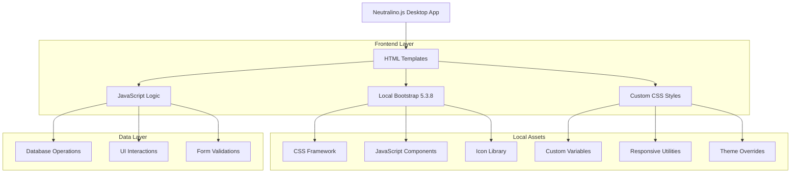
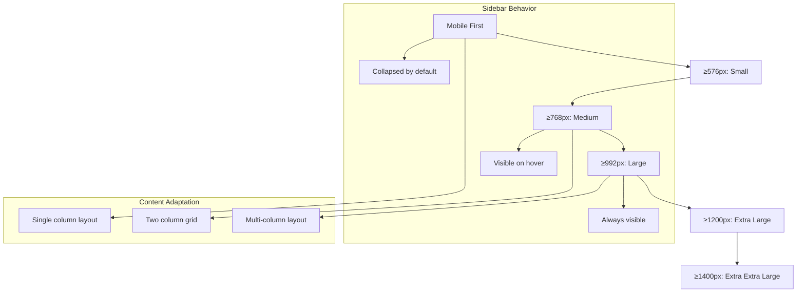

## 1. Architecture design

## 2. Technology Description
- **Frontend**: HTML5 + Bootstrap 5.3.8 + Custom CSS3 + Vanilla JavaScript
- **Framework**: Neutralino.js (Lightweight desktop application framework)
- **Database**: SQLite (Local database file)
- **Typography**: Outfit Variable Font (Local TTF file)
- **Icons**: Bootstrap Icons 1.11.0 (Local WOFF/WOFF2 files)
- **Build Tool**: None (Direct file serving)
- **Package Manager**: None (All dependencies stored locally)

## 3. Route definitions
| Route | Purpose |
|-------|---------|
| /resources/html/index.html | Dashboard with statistics and quick actions |
| /resources/html/bookshelf-books.html | Book catalog management page |
| /resources/html/bookshelf-copies.html | Individual book copy tracking |
| /resources/html/students.html | Student records and management |
| /resources/html/transactions_borrow.html | Borrowing transaction records |
| /resources/html/transaction_library.html | Library transaction overview |

## 4. Asset Optimization Strategy

### 4.1 CSS Optimization
- **Bootstrap Customization**: Utilize Bootstrap 5.3.8 CSS variables for theme consistency
- **Critical CSS**: Inline critical styles for above-the-fold content
- **Unused CSS Removal**: Audit and remove unused Bootstrap utility classes
- **Custom Properties**: Define CSS custom properties for Bicol University brand colors

### 4.2 JavaScript Optimization
- **Bundle Analysis**: Review JavaScript file dependencies and loading order
- **Lazy Loading**: Implement lazy loading for non-critical JavaScript modules
- **Event Delegation**: Optimize event handling using delegation patterns
- **DOM Caching**: Cache frequently accessed DOM elements

### 4.3 Font Optimization
- **Variable Font Loading**: Optimize Outfit font loading with font-display: swap
- **Font Subsetting**: Create subset fonts for commonly used characters
- **Preloading**: Preload critical fonts using link rel="preload"

### 4.4 Image Optimization
- **Responsive Images**: Implement responsive image techniques for building background
- **Image Compression**: Optimize background images without quality loss
- **Lazy Loading**: Implement lazy loading for non-critical images

## 5. Responsive Design Implementation

### 5.1 Breakpoint Strategy

### 5.2 Component Responsive Patterns
- **Navigation Sidebar**: Collapsible on mobile, fixed on desktop
- **Statistics Cards**: Stack vertically on mobile, grid layout on desktop
- **Data Tables**: Horizontal scroll on mobile, full table on desktop
- **Modal Dialogs**: Full-screen on mobile, centered on desktop
- **Button Groups**: Stack vertically on mobile, horizontal on desktop

## 6. Accessibility Implementation

### 6.1 Semantic HTML Structure
- **ARIA Labels**: Proper labeling for interactive elements
- **Heading Hierarchy**: Maintain proper h1-h6 structure
- **Landmark Regions**: Define main, nav, and aside regions
- **Form Labels**: Associate labels with form controls

### 6.2 Keyboard Navigation
- **Tab Order**: Logical tab order throughout the application
- **Focus Indicators**: Visible focus indicators for all interactive elements
- **Skip Links**: Provide skip navigation for screen readers
- **Escape Key**: Modal dialogs closable with Escape key

### 6.3 Screen Reader Support
- **Alt Text**: Descriptive alt text for all images
- **Live Regions**: Announce dynamic content changes
- **Role Attributes**: Proper ARIA roles for custom components
- **State Announcements**: Announce loading states and errors

## 7. Performance Optimization

### 7.1 Loading Performance
- **Critical Path**: Optimize critical rendering path
- **Resource Hints**: Use dns-prefetch and preconnect for external resources
- **Compression**: Enable gzip compression for text assets
- **Caching**: Implement appropriate cache headers for static assets

### 7.2 Runtime Performance
- **DOM Manipulation**: Minimize DOM manipulation operations
- **Event Handling**: Use efficient event handling patterns
- **Memory Management**: Prevent memory leaks in long-running application
- **Animation Performance**: Use CSS transforms for animations

### 7.3 Database Performance
- **Query Optimization**: Optimize SQL queries for better performance
- **Indexing**: Create appropriate database indexes
- **Connection Pooling**: Implement connection pooling for database operations
- **Lazy Loading**: Load data on demand rather than upfront

## 8. Bootstrap 5 Implementation Guidelines

### 8.1 Component Usage
- **Cards**: Use Bootstrap cards for content containers
- **Modals**: Implement Bootstrap modal components for forms
- **Tables**: Utilize Bootstrap table classes for data display
- **Forms**: Use Bootstrap form controls and validation classes
- **Buttons**: Apply consistent Bootstrap button styling
- **Grid System**: Leverage Bootstrap grid for responsive layouts

### 8.2 Customization Approach
- **Theme Variables**: Override Bootstrap CSS variables for brand consistency
- **Utility Classes**: Use Bootstrap utility classes for spacing and alignment
- **Custom Components**: Extend Bootstrap components with custom styling
- **Responsive Utilities**: Utilize Bootstrap responsive utility classes

### 8.3 JavaScript Integration
- **Bootstrap Bundle**: Use local bootstrap.bundle.js for component functionality
- **Custom Scripts**: Load custom JavaScript after Bootstrap initialization
- **Event Handling**: Use Bootstrap event system for component interactions
- **Plugin Usage**: Leverage Bootstrap plugins for advanced functionality