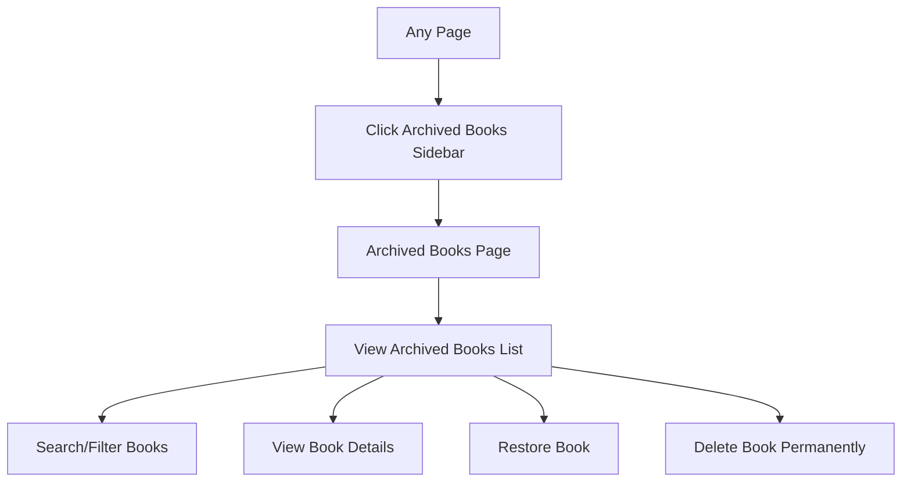

## 1. Product Overview
Add an "Archived Books" tab to the sidebar navigation that allows users to view and manage archived books. This feature will provide a dedicated page to browse archived books with their copy counts and maintain consistent UI with the existing design.

The archived books functionality already exists in the backend, but there's currently no dedicated page to view archived books after they've been archived from the main books management page.

## 2. Core Features

### 2.1 User Roles
| Role | Registration Method | Core Permissions |
|------|---------------------|------------------|
| Librarian | System administrator assignment | Can view archived books, restore archived books, permanently delete archived books |
| Admin | System administrator assignment | Full access to archived books management including viewing, restoring, and permanent deletion |

### 2.2 Feature Module
The archived books requirements consist of the following main pages:
1. **Archived Books page**: displays list of archived books with copy counts, search/filter functionality, and management options.

### 2.3 Page Details
| Page Name | Module Name | Feature description |
|-----------|-------------|---------------------|
| Archived Books | Sidebar Navigation | Add "Archived Books" link at the bottom-most position in the sidebar with archive icon. Maintain consistent styling with existing navigation items. |
| Archived Books | Book List Display | Display archived books in a table format showing book title, author, publication date, department, and archived copy count. Include search and filter functionality. |
| Archived Books | Book Management | Provide options to view archived book details, restore archived books back to active collection, and permanently delete archived books. |
| Archived Books | Copy Information | Show the number of archived copies for each book and provide access to view individual copy details. |

## 3. Core Process
**Librarian/Admin Flow:**
1. User navigates to any page in the system
2. User clicks on "Archived Books" in the sidebar (bottom-most position)
3. System displays the archived books page with all archived books
4. User can search/filter archived books by title, author, or department
5. User can view detailed information about archived books and their copies
6. User can restore archived books back to the active collection
7. User can permanently delete archived books if needed

## 4. User Interface Design

### 4.1 Design Style
- **Primary Colors**: Maintain existing BCULMS color scheme (blues and whites)
- **Button Style**: Bootstrap rounded buttons with consistent sizing
- **Font**: Continue using existing font family (Outfit)
- **Layout Style**: Card-based layout with proper spacing and shadows
- **Icons**: Use Bootstrap Icons for consistency (archive icon for sidebar)

### 4.2 Page Design Overview
| Page Name | Module Name | UI Elements |
|-----------|-------------|-------------|
| Sidebar | Archived Books Link | Use `bi-archive` icon, positioned at bottom of sidebar navigation, same styling as existing nav items with `mb-3` spacing |
| Archived Books | Header Section | Page title "Archived Books" with search bar and department filter dropdown |
| Archived Books | Book Table | Responsive table with columns: Title, Author, Publication Date, Department, Archived Copies, Actions |
| Archived Books | Action Buttons | Restore button (primary color), Delete button (danger color), View Details button (info color) |

### 4.3 Responsiveness
- **Desktop-first approach**: Optimized for desktop usage as primary target
- **Mobile-adaptive**: Responsive design that works on tablets and mobile devices
- **Touch interaction**: Properly sized buttons and links for touch interfaces