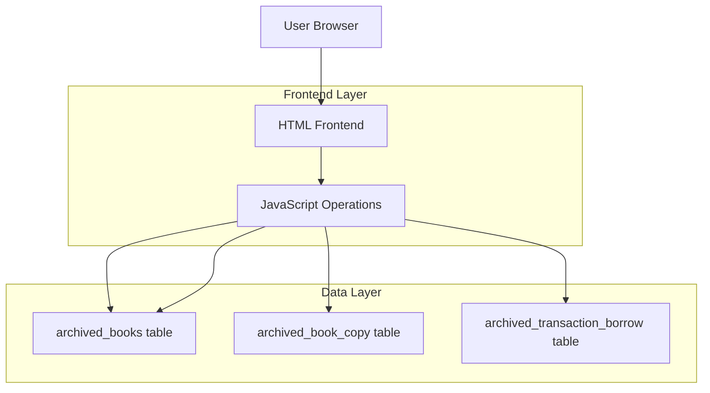
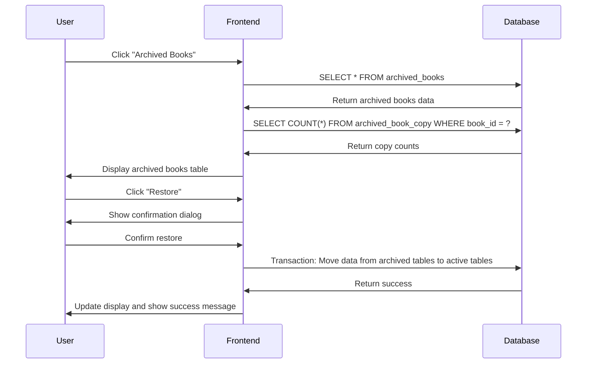

## 1. Architecture design



## 2. Technology Description
- **Frontend**: Vanilla HTML5 + Bootstrap 5 + Custom CSS
- **Backend**: NeutralinoJS (desktop application framework)
- **Database**: SQLite (local database)
- **Architecture**: Single-page application with multiple HTML pages

## 3. Route definitions
| Route | Purpose |
|-------|---------|
| /resources/html/archived-books.html | Archived Books management page |

## 4. Database Schema

### 4.1 Existing Tables (relevant to archived books)
The system already has the following tables for archived books:

**archived_books table:**
```sql
CREATE TABLE "archived_books" (
    "archive_id" INTEGER NOT NULL UNIQUE,
    "book_id" INTEGER NOT NULL UNIQUE,
    "book_title" TEXT NOT NULL,
    "archive_date" TEXT NOT NULL,
    "due_date" TEXT,
    PRIMARY KEY("archive_id"),
    FOREIGN KEY("book_id") REFERENCES "books"("book_id") ON DELETE CASCADE
);
```

**archived_book_copy table:**
```sql
CREATE TABLE "archived_book_copy" (
    "copy_id" TEXT NOT NULL UNIQUE,
    "book_id" TEXT NOT NULL,
    "status" TEXT NOT NULL,
    "condition" TEXT NOT NULL,
    "borrowed_date" TEXT,
    "returned_date" TEXT,
    "due_date" TEXT,
    "archived_at" TEXT,
    PRIMARY KEY("copy_id")
);
```

**archived_transaction_borrow table:**
```sql
CREATE TABLE "archived_transaction_borrow" (
    "book_id" INTEGER NOT NULL,
    "copy_id" TEXT,
    "borrower_id" TEXT NOT NULL,
    "transaction_type" TEXT NOT NULL,
    "borrowed_at" TEXT,
    "due_at" TEXT,
    "returned_at" TEXT,
    "staff_id" TEXT NOT NULL,
    "archived_at" TEXT,
    "archive_reason" TEXT
);
```

### 4.2 API Operations

**Get Archived Books:**
```javascript
// Retrieve all archived books with department information
const archivedBooks = await insertDB("select", "archived_books", "*", {});
```

**Get Archived Book Copies Count:**
```javascript
// Get copy count for a specific archived book
const copyCount = await insertDB("select", "archived_book_copy", "COUNT(*) as count", { book_id: bookId });
```

**Restore Archived Book:**
```javascript
// Move book from archived_books back to books table
// Move copies from archived_book_copy back to book_copy table
// This operation requires transaction management
```

**Permanently Delete Archived Book:**
```javascript
// Remove book and all related archived data permanently
// This operation requires careful transaction management
```

## 5. Frontend Implementation

### 5.1 Sidebar Modification
All existing HTML pages need to be updated to include the new "Archived Books" link at the bottom of the sidebar navigation:

```html
<!-- Add this before the closing </nav> tag in sidebar -->
<a class="nav-link mb-3" href="./archived-books.html">
  <p></p>
  <span class="icon">
    <i class="bi bi-archive"></i>
  </span>
  <span class="description">Archived Books</span>
</a>
```

### 5.2 New Archived Books Page
Create a new HTML page `archived-books.html` with:
- Consistent sidebar navigation (with active state for Archived Books)
- Header with search and filter functionality
- Responsive table displaying archived books
- Action buttons for restore and delete operations
- Modal dialogs for confirmation actions

### 5.3 JavaScript Operations
Create new JavaScript functions for archived books management:
- `loadArchivedBooks()` - Load and display archived books
- `getArchivedBookCopiesCount(bookId)` - Get copy count for archived books
- `restoreArchivedBook(bookId)` - Restore book from archive
- `deleteArchivedBookPermanently(bookId)` - Permanently remove archived book

## 6. Data Flow

