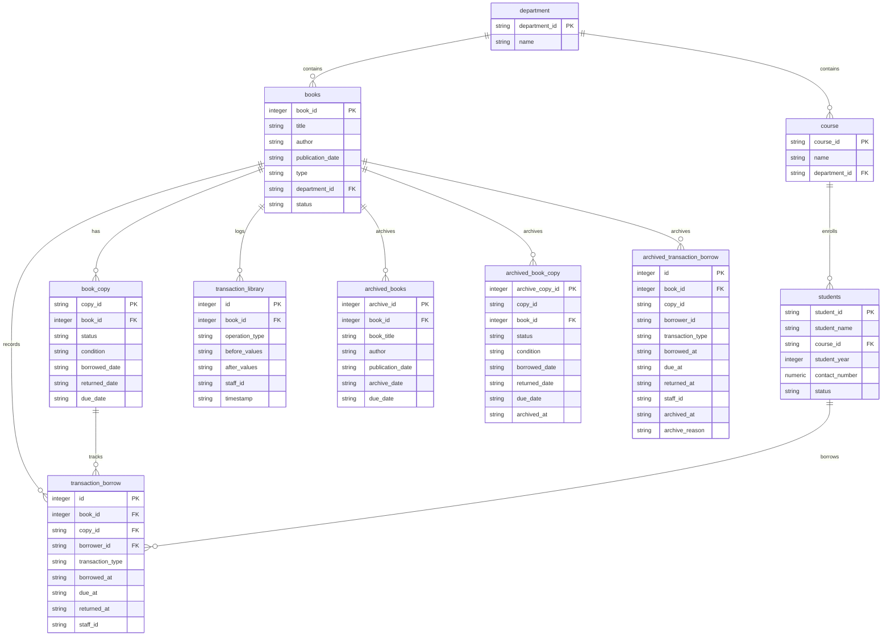
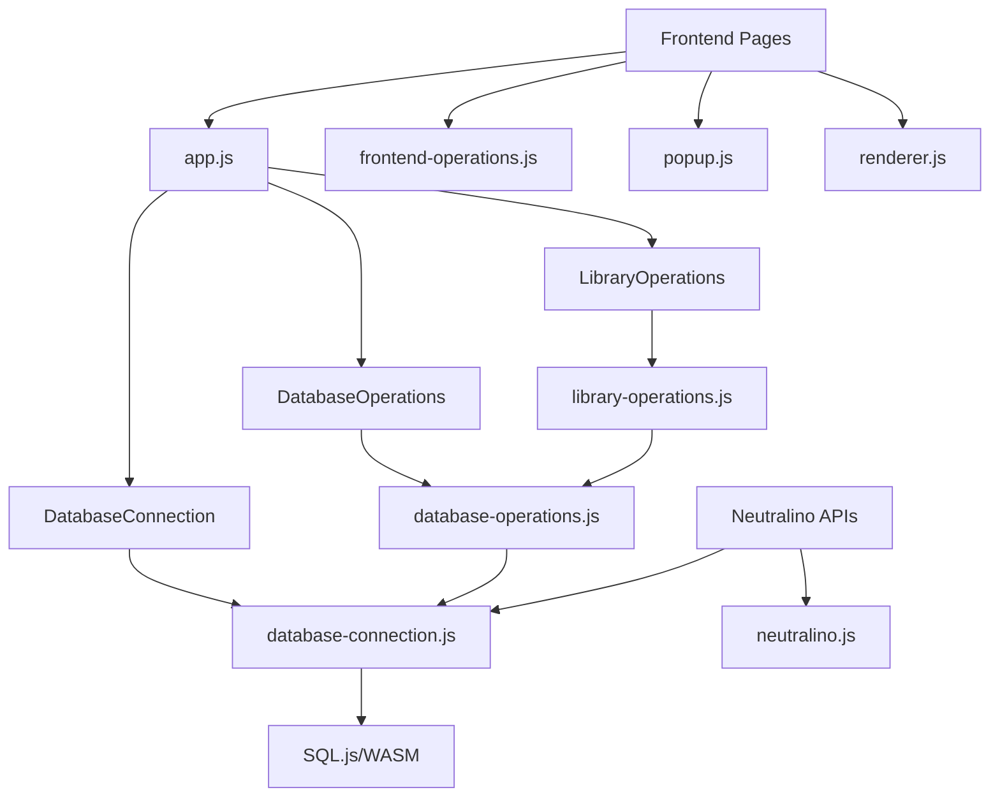

# BCULMS - Baguio Central University Library Management System

## 1. Entity Relationship Diagram (ERD)



## 2. JavaScript Classes, Files, and Function Connections

### Core Architecture


### File Structure and Dependencies

#### Core System Files
- **app.js**: Main application bootstrap and page initialization
- **database-connection.js**: DatabaseConnection class handling DB path, initialization, integrity checks
- **database-operations.js**: DatabaseOperations class providing CRUD wrappers
- **library-operations.js**: LibraryOperations class for domain-specific operations
- **create-table.js**: DatabaseSchema class for schema creation and migrations

#### Frontend Support Files
- **frontend-operations.js**: Convenience getters for data retrieval
- **popup.js**: Modal and popup management
- **renderer.js**: UI rendering utilities
- **dashboard.js**: Dashboard-specific functionality
- **search.js**: Search functionality
- **filter.js**: Data filtering utilities

#### Page-Specific Files
- **archived-books.js**: Archived books management
- **getFromDB.js**: Data retrieval operations
- **insertIntoDB.js**: Data insertion operations

### Key Class Relationships

#### DatabaseConnection Class
- **Purpose**: Manages SQLite database connection via SQL.js
- **Key Methods**: 
  - `initPath()`: Initializes document paths
  - `initDB()`: Creates/opens database
  - `saveDB()`: Persists database changes
  - `checkIntegrity()`: Validates database integrity
  - `recoverCorruptDB()`: Handles corruption recovery

#### DatabaseOperations Class
- **Purpose**: Provides CRUD operations with transaction support
- **Key Methods**:
  - `insertDB()`: Generic CRUD dispatcher
  - `handleInsert()`: Parameterized INSERT operations
  - `handleUpdate()`: Parameterized UPDATE operations
  - `handleDelete()`: Parameterized DELETE operations
  - `handleSelect()`: Parameterized SELECT operations
  - `runTransaction()`: Atomic transaction wrapper

#### LibraryOperations Class
- **Purpose**: Implements library domain logic
- **Key Methods**:
  - `insertBook()`: Adds new books with copies
  - `updateBook()`: Updates book information
  - `archiveBook()`: Archives books with full audit trail
  - `restoreArchivedBook()`: Restores archived books
  - `insertStudent()`: Adds student records
  - `generateCopyId()`: Creates deterministic copy IDs

## 3. System Requirements

### Runtime Requirements
- **NeutralinoJS Runtime**: v6.2.0
- **Operating System**: Windows, macOS, or Linux
- **Memory**: Minimum 512MB RAM
- **Storage**: 100MB free space for application and database

### Development Requirements
- **Node.js**: LTS version (for development)
- **Neutralino CLI**: For development builds
- **Text Editor**: Any modern code editor

### Browser Requirements (for web mode)
- **Modern Browser**: Chrome, Firefox, Safari, Edge
- **WebAssembly Support**: Required for SQL.js
- **JavaScript**: ES6+ support

### Database Requirements
- **SQLite**: Embedded via SQL.js
- **SQL.js**: WebAssembly SQLite implementation
- **Storage Location**: User's Documents folder (`Documents/BCULMS/data/`)

## 4. Frontend Design

### UI Framework
- **Bootstrap 5**: CSS framework for responsive design
- **Bootstrap Icons**: Icon library
- **Custom CSS**: Additional styling in `styles.css`

### Page Structure
```
resources/html/
├── index.html              # Dashboard with statistics
├── bookshelf-books.html    # Book management
├── bookshelf-copies.html   # Copy management
├── students.html          # Student management
├── transactions_borrow.html # Borrow transactions
├── transaction_library.html # Library operations log
└── archived-books.html    # Archived items
```

### Design Principles
- **Responsive Design**: Mobile-first approach
- **Accessibility**: ARIA labels and semantic HTML
- **Loading States**: Progress indicators during operations
- **Error Handling**: User-friendly error messages
- **Navigation**: Collapsible sidebar navigation

### Key UI Components
- **Dashboard Cards**: Statistics display with real-time updates
- **Modal Forms**: Add/edit forms with validation
- **Data Tables**: Sortable, searchable tables
- **Action Buttons**: Contextual actions per record
- **Status Indicators**: Color-coded status badges

## 5. Backend Design

### Architecture Pattern
- **Desktop Application**: NeutralinoJS-based desktop app
- **Embedded Database**: SQLite via SQL.js WebAssembly
- **File-based Storage**: Local filesystem storage
- **No Server Required**: Runs entirely client-side

### Data Layer
- **Database Engine**: SQLite 3.x via SQL.js
- **Connection Management**: Singleton pattern with connection pooling
- **Transaction Support**: ACID transactions for data integrity
- **Backup System**: Automatic corruption detection and recovery

### Business Logic Layer
- **Domain Operations**: LibraryOperations class encapsulates business rules
- **Validation**: Input validation at operation level
- **Audit Trail**: Complete transaction logging
- **Archival System**: Soft delete with full restoration capability

### Service Layer
- **CRUD Operations**: Generic database operations
- **Search Operations**: Full-text search capabilities
- **Report Generation**: Statistics and analytics
- **Data Export**: Potential for CSV/JSON export

### Security Considerations
- **Local Storage**: All data stored locally on user's machine
- **No Network Communication**: No external API calls
- **File Permissions**: Restricted to user's document directory
- **Data Integrity**: Automatic backup and corruption recovery

## 6. Database Design

### Core Tables

#### books
- **Purpose**: Stores book metadata
- **Primary Key**: `book_id` (AUTOINCREMENT)
- **Foreign Keys**: `department_id` → department.department_id
- **Indexes**: Primary key, department_id

#### book_copy
- **Purpose**: Tracks physical copies of books
- **Primary Key**: `copy_id` (TEXT)
- **Foreign Keys**: `book_id` → books.book_id
- **Indexes**: Primary key, book_id, copy_id

#### students
- **Purpose**: Student information
- **Primary Key**: `student_id` (TEXT)
- **Foreign Keys**: `course_id` → course.course_id
- **Indexes**: Primary key, course_id

#### department
- **Purpose**: Academic departments
- **Primary Key**: `department_id` (TEXT)
- **Indexes**: Primary key

#### course
- **Purpose**: Academic courses
- **Primary Key**: `course_id` (TEXT)
- **Foreign Keys**: `department_id` → department.department_id
- **Indexes**: Primary key, department_id

### Transaction Tables

#### transaction_borrow
- **Purpose**: Borrow/return transactions
- **Primary Key**: `id` (AUTOINCREMENT)
- **Foreign Keys**: 
  - `book_id` → books.book_id
  - `copy_id` → book_copy.copy_id
  - `borrower_id` → students.student_id
- **Indexes**: All foreign keys, dates, transaction_type

#### transaction_library
- **Purpose**: Library operation audit log
- **Primary Key**: `id` (AUTOINCREMENT)
- **Foreign Keys**: `book_id` → books.book_id
- **Indexes**: book_id, operation_type, timestamp

### Archive Tables

#### archived_books
- **Purpose**: Stores archived book records
- **Primary Key**: `archive_id`
- **Foreign Keys**: `book_id` → books.book_id
- **Indexes**: Primary key, book_id

#### archived_book_copy
- **Purpose**: Archived copy records
- **Primary Key**: `archive_copy_id`
- **Foreign Keys**: `book_id` → books.book_id
- **Indexes**: book_id, copy_id

#### archived_transaction_borrow
- **Purpose**: Archived borrow transactions
- **Primary Key**: `id`
- **Foreign Keys**: 
  - `book_id` → books.book_id
  - `borrower_id` → students.student_id
- **Indexes**: All foreign keys, dates

### Database Features
- **Foreign Key Constraints**: Enforces referential integrity
- **Cascading Deletes**: Automatic cleanup of related records
- **Indexes**: Optimized for common query patterns
- **Audit Trail**: Complete operation history
- **Soft Deletes**: Archival system preserves historical data
- **Automatic Backups**: Corruption detection and recovery

### Data Integrity
- **Transaction Support**: ACID compliance via SQLite
- **Constraint Validation**: Foreign key and data type validation
- **Backup Strategy**: Automatic backup on corruption detection
- **Recovery Mechanism**: Automatic database recreation if corrupted